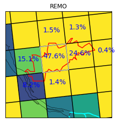

# Data Processing Guide
## Tipps and Tricks for Data Processing
The Data Processing Guide will collect information, best practices and FAQs concerning data processing

### Contributors
Katharina Bülow, Lars Buntemeyer
Contributions from: Lola Kotova, Christine Nam

### Introduction

## Remo Output

## Interpolation to Station

## Troubleshooting for PyPlotTools

### Plotting netcdf file

PyPlotTools are for plotting netcdf output data from RCMs.

First you have to download it from the git:

 1. Make a directory PyPlotTools in your home directory or favorite place, where you store your software!
 2. cd PyPlotTools
 3. git init
 4. git pull https://git.gerics.de/PyREMO/PyPlotTools
 5. check with: git status

Now you have all python routines and a __manual pyplottools-1.2.4.pdf__.

There are little things in netcdf files, which can course problemes using the PyPlotTools:

#### pyxy

#### Does not read all files
If you want to plot multiple files and pyxy does not read all files, check, if
__all the files have the same file length__.

#### The time axis is not displayed in years

If you excecute:

    pyxy snd png.lgout.scr "snd" xyears yauto 0 0.3 infile

and _xyears_ does not help to have years (_1996, 1998, 2000_) on the x axis, you can apply the following to your netcdf input file:

    cdo -a copy input output

and then try to plot it again.

#### pycontf

#### pyvect

#### pycontfvect

#### pyclimdia

