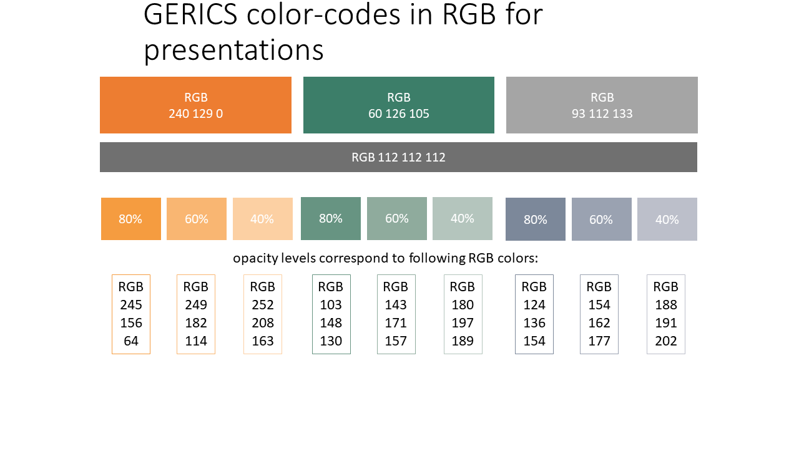

# **Regional climate change assessment and uncertainty analysis**

## *Short course by T. Weber and A. Kriegsmann*

# Introduction into climate modelling

Applied software: Virtual Box, Kubuntu 18.04 (Linux-System), Climate Data Operator (CDO), Python/PyNgl - All software is free!

## Climate modelling
### Weather vs. Climate
### Definition:
**Weather**
Physical state of the Atmosphere
at a certain place and time. It can be characterised by meteorological parameters, e.g. air pressure, temperature, humidity, precipitation

**Climate**
Climate, sometimes understood as the "average weather,” is defined as the measurement of the mean and variability of relevant quantities of certain variables (such as temperature, precipitation or wind) over a period of time, ranging from months to thousands or millions of years (Classical time period 30 years)
(Source WMO)

The Climate System

### Climate Variablility
* Climate Change: Statistically significant change persisting over a long time period * 
* Variations of climate at all temporal and spatial scales (which are beyond single weather events); due to internal feedbacks within the climate system and due to external forcings *
* internal Climate Variability
* Non-linear processes in the climate system and feedbacks between its components, e.g. between ocean and atmosphere (ENSO, NAO)
* External Climate Variability
* Natural forcing: 
*Anthropogenic Climate Change*
e.g. solar variability, earth rotation, earth declination, earth orbital parameters, natural composition of the atmosphere, volcanic eruptions, continental drift
* Human Forcing:
*Anthropogenic Climate Change*
Emissions of greenhouse gases and aerosols to the atmosphere Land use change,
e.g. deforestation

### Impact of Natural and Anthropogenic Forcing
Climate models can only reproduce the observed spatial and temporal patterns of warming when they include natural AND anthropogenic forcings

### Key Questions about the climate system and its relation to human kind

### Climate Modelling
Climate models are the most sophisticated approach to simulate the Earth System.
This involves the description of the major processes occurring

* in the atmosphere (both physical and chemical processes),
* in the oceans (both physical and chemical processes)
* on the land surface (vegetation, biogeochemistry)
* AND the simulations of the interactions between the different systems as well as human interference into the system

The growth of computer power, plus of our knowledge of planetary systems, has allowed these models to become increasingly powerful.
There are several limitations in climate modeling:

* Availability of data/information to understand and describe the processes e.g. processes in the deep ocean, but also for processes over land
* Constraints in computational capacity Atmospheric variables at each grid point requires the storage, retrieval, recalculation and re-storage of 105 figures at every time-step

  * Models contain thousands of grid points
  * GCMs are computationally expensive

#### Gid sizes:

#### The major challenge
Climate models must simulate many physical processes across a wide range of spatial and temporal scales.

#### Climate Model Development (IPCC AR5, WG1, Chapter 1)

#### MPIESM

#### Multi-Emission Scenarios
Anthropogenic radiative forcing in Representative Concentration Pathways (RCPs) and  former Special Report on Emissions Scenarios (SRES)
 (W m–2) relative to preindustrial level (about 1765) between 1950 and 2100.")

#### Which model approach for which purpose?
* Studies on global to continental climate change, global to continental carbon cycle, etc.
  - Global models
* Studies on continental to regional climate change and impact assessment
  - Global and regional models
* Studies on national climate change and impact assessment
  - Regional models (both dynamical and statistical)
* Subnational to local climate change assessment
  - Mainly statistical approaches to link regional synoptic patterns with local station data 

#### Regional Climate modelling

# Climate data processing using scripts
# Visualisation of climate change information

# GERICS RGB CODE

