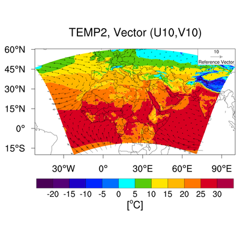
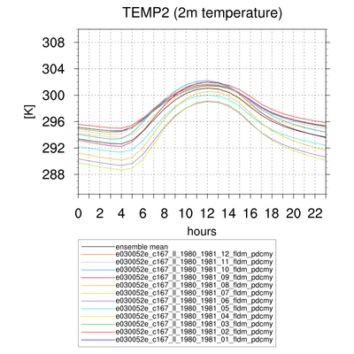
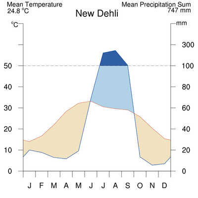

#  Visualisation of Climate Data
using PyNGL developed by NCAR
*by T. Weber and A. Kriegsmann

**PyNGL freely available!**

Webpage: https://www.pyngl.ucar.edu/

## PyPlotTools-1.2.4
Collection of bash scripts creating plots with python

by Torsten Weber

#### Why?
* To have a quick look at the data
* To create simple plots with different features via command line
* To avoid increasing number of similar plot scripts

#### What?
* Five different bash scripts which create plots from NetCDF files by means of python
* Able to handle rotated coordinates by using PyRemo (thanks to the developer!)
* Works half-automatically
* Contains help text 
* Running on mistralpp/eddy 
* Can also be applied to different data sets, e.g. REMO data, ESM data, CRU data, etc.

#### What kind of plots?
*pycontf* – contour fill plots

*pyvect* – vector plots

*pycontfvect* – contour fill plots with an overlayed vector field

Features: plot non-rotated or rotated coordinates, collection of predefined colormaps,
                 individual colormaps can be included, unit conversion, different plot formats,
                 mark area with undefined values
*pyxy* – line plots

Features: predefined colors/line pattern/x-axes (auto, daily/annual cycle, months, years),
                 unit conversion, ensemble mean, running average, legend, different plot formats

*pyclimdia* – climate diagram (Walter-Lieth style)

Features: annual cycle of temperature, precipitation and optional frost days,  
                 different order of months for northern and southern hemisphere, different plot formats

#### Commands

     pycontf <nc-file> <var_name> <output> (mandatory)

     pycontf <nc-file> <var_name> <output> [<title> <colorbar> <cmin> <cmax> <clevs>]

     pyvect <u_nc-file> <u-var_name> <v_nc-file> <v_var_name> <output> (mandatory)

     pycontfvect <scalar_nc-file> <scalar_name> <u_nc-file> <u_var_name> <v_nc-file>
                     <v_var_name> <output> (mandatory)

     pyxy <var_name> <output> <title> <xaxis> <yaxis> <ymin> <ymax> <nc-file(s)> 
         (mandatory)

     pyclimdia  <output> <loc_name> <tmin> <pmax> <hem> <t_nc-file> <t_var_name> 
                   <p_nc-file> <p_var_name> (mandatory)

### Known Issues
* Warnings: „tmEqualizeXYSizes is not a valid resource in x.PlotManage at this time”
* Spaces between latitude/longitude tickmarks are automatically determined
* Colorbar and figure title are coupled
* National boundaries in low resolution from the 90's -> medium resolution up to date
* PyRemo: some workarounds to fix bugs and to get additional data information (CDO's)

## Instalation
eddy:
* modules to be loaded: python/2.7-ve0, cdo/1.9.5
* Git source: http://FIRSTNAME.LASTNAME@git.gerics.de/PyREMO/PyPlotTools.git
* Git source: http://FIRSTNAME.LASTNAME@git.gerics.de/PyREMO/PyREMO.git
* PyPlotTools needs to be included in the PATH variable (.profile)
* PyREMO needs to be included in the PYTHON-PATH variable (.profile)

MOTRE INFORMATION:
https://git.gerics.de/PyREMO/PyPlotTools

